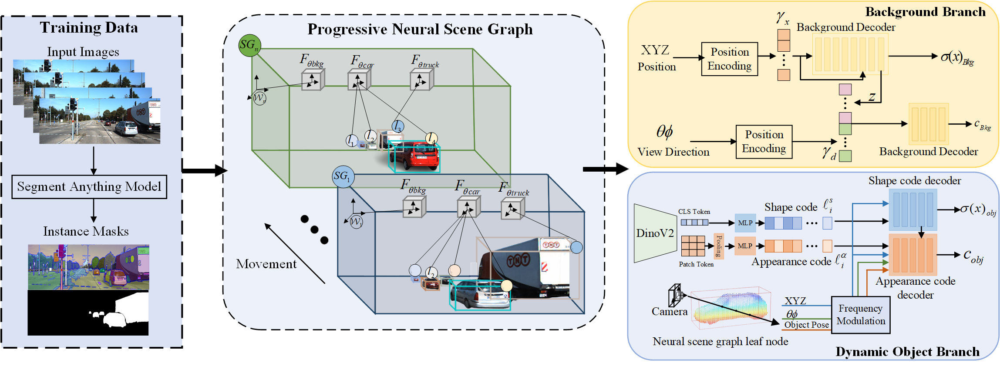

# 

<p align="center">

  <h1 align="center">ProSGNeRF: Progressive Dynamic Neural Scene Graph with Frequency Modulated Foundation Model in Urban Scenes
</h1>
  <h3 align="center">IJCV Submission</h3>
  <div align="center"></div>
</p>

<p align="center">
  <a href="">
    
  </a>
</p>

<br>
<!-- TABLE OF CONTENTS -->
<details open="open" style='padding: 10px; border-radius:5px 30px 30px 5px; border-style: solid; border-width: 1px;'>
  <summary>Table of Contents</summary>
  <ol>
    <li>
      <a href="#installation">Installation</a>
    </li>
    <li>
      <a href="#demo">Online Demo</a>
    </li>
    <li>
      <a href="#usage">Usage</a>
    </li>
    <li>
      <a href="#downloads">Downloads</a>
    </li>
    <li>
      <a href="#benchmarking">Benchmarking</a>
    </li>
    <li>
      <a href="#acknowledgement">Acknowledgement</a>
    </li>
    <li>
      <a href="#citation">Citation</a>
    </li>
  </ol>
</details>

# Notes

- [] We have updated the `README.md` and are preparing to open-source our code！  
- [] Code for main parts, including `optimizer`, `renderer`, `progressive Scene Graph modules`, 
- [] Installation setup

# 🛠️ Setup
The code has been tested on:

- Ubuntu 22.04 LTS, Python 3.9.14, CUDA 11.3, GeForce RTX 4090/RTX 3090

## 📦 Repository

Clone the repo with `--recursive` because we have submodules:

```
git clone --recursive git@github.com/dtc111111/prosgnerf.git
cd prosgnerf
```
Then setup environment from the provided conda environment file,

```
conda create -n prosgnerf 
conda env update --file environment.yml --prune
conda activate prosgnerf
```

## 🚀 Usage

Here we elaborate on how to load the necessary data, configure prosgnerf for your use-case, debug it, and how to reproduce the results mentioned in the paper.

#### KITTI

1. Get the [KITTI MOT dataset](http://www.cvlibs.net/datasets/kitti/eval_tracking.php), from which you need:
   1. [Left color images](http://www.cvlibs.net/download.php?file=data_tracking_image_2.zip)
   2. [Right color images](http://www.cvlibs.net/download.php?file=data_tracking_image_3.zip)
   3. [GPS/IMU data](http://www.cvlibs.net/download.php?file=data_tracking_oxts.zip)
   4. [Camera Calibration Files](http://www.cvlibs.net/download.php?file=data_tracking_calib.zip)
   5. [Training labels](http://www.cvlibs.net/download.php?file=data_tracking_label_2.zip)
2. Extract everything to ```./data/kitti``` and keep the data structure

#### Virtual KITTI 2

```
bash ./download_virtual_kitti.sh
```
---

## Training


To optimize models on a subsequence of Virtual KITTI 2 or KITTI, create the environment,
download the data set (1.2) and optimize the (pre-trained) background and object
models together:

```
conda create -n prosgnerf--file requirements.txt -c conda-forge -c menpo
conda activate prosgnerf
```

vkitti2 example:
```
python main.py --config configs/oct01.txt
tensorboard --logdir=example_weights/summaries --port=6006
```
KITTI example:
```
python main.py --config configs/oct01.txt
tensorboard --logdir=example_weights/summaries --port=6006
```

To render a pre-trained download the weights or use your own model.
```
bash download_weights_kitti.sh
```
To make a full render pass over all selected images (between the first and last frame) run the provided config with 'render_only=True'.
- To render only the outputs of the static background node use 'bckg_only=True'
- for all dynamic parts set 'obj_only=True' & 'white_bkgd=True'
```
python main.py --config example_configs/config_kitti_0006_example_render.txt
```
